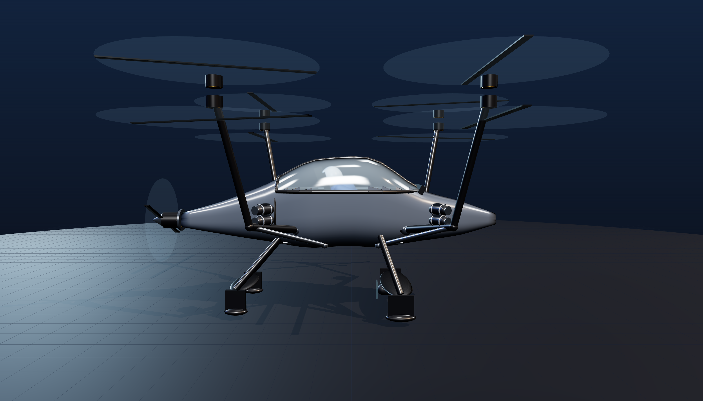
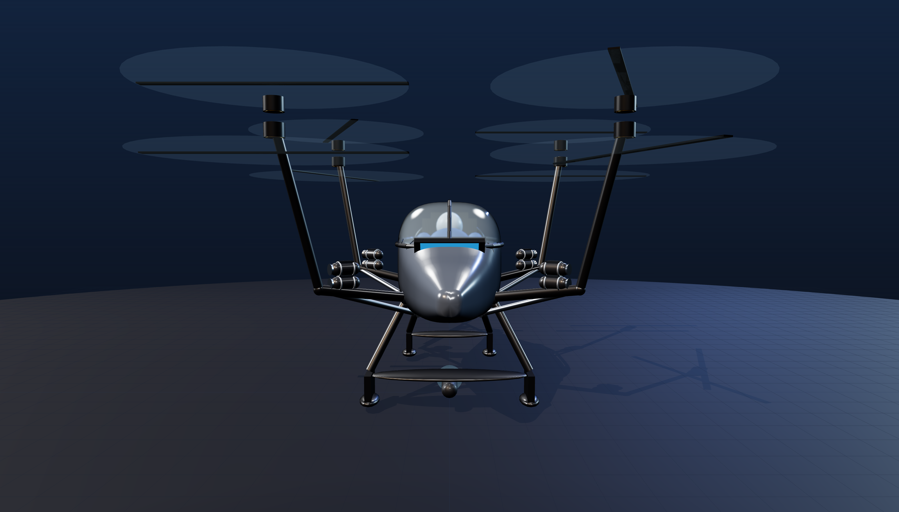
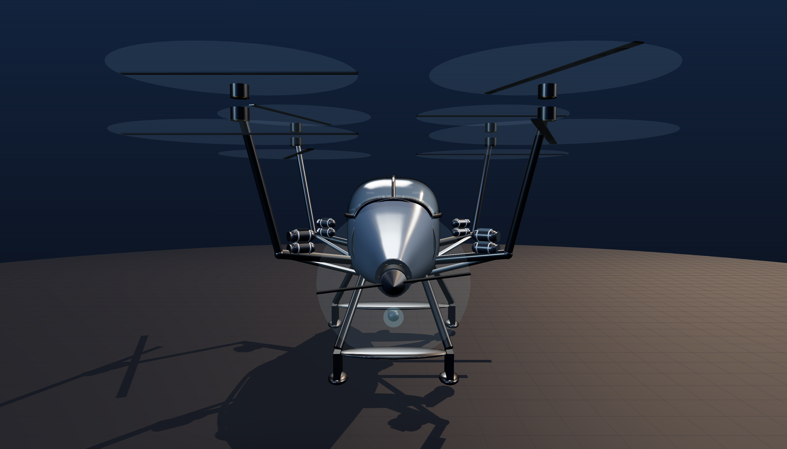

# Sky Tribe — Open Amphibious Personal eVTOL
*A single-seat electric flying machine that lands on water and takes off again. Designed and built in America, given away to everyone.*



> **Mission:** This project is about freedom of movement, not force. Quiet electric flight. Fewer barriers between people and places. A machine that treats the ocean as a friend — never a weapon. We build it to unite, to explore, and to give people more free will in how they move through the world.

| | |
|---|---|
|  |  |

## What this is
A fully open-source design for a **single-seat coaxial-X8 electric VTOL** — eight motors on four arms — that is sealed and buoyant so it can **land on water and take off again**, like the waterproof RC drones, scaled up to carry one person.

Everything is open: the CAD, the parts list, the flight-control approach, and the research behind every decision. No proprietary black boxes. If someone already gave their work away (open-source flight software, published physics), we build on it and give ours away too.

**Every number below is one we can defend, including the ones that hurt.**

## Two aircraft, one airframe
The weight limit was blocking everything, so we stopped letting it. Same airframe, same X8, same quick-swap battery bay — two configurations in two different legal lanes.

| | **P1 — "the fat crazy one"** | **P2 — "the low-cost lightweight one"** |
|---|---|---|
| Empty | ~176 kg | ~124 kg |
| Battery | 13 kWh · 58 kg | 5 kWh · 20 kg |
| Endurance | ~14 min hover / ~21 min cruise | ~7 min hover / ~11 min cruise |
| Speed | ~75–80 mph (rear pusher) | ~50–65 mph (rotor tilt only) |
| Legal lane | Experimental amateur-built (N-number, licensed pilot) | **Part 103 ultralight** — no licence, no registration |
| Purpose | The learning machine. Flies first. Weight is not a constraint. | The production seed. Built with P1's lessons. |

P1 exists so the program isn't hostage to the 254 lb limit. P2 is the machine anyone can legally fly.

## Current design
- **Propulsion:** coaxial **X8** — 8 motors, 4 arms, 2× 62" counter-rotating props per arm, ~33 kg/m² disk loading
- **Why X8:** a flat quad has **no motor-out capability** — one dead motor or ESC and it is uncontrollable. The literature is blunt about it: a single-rotor failure on a manned quad is catastrophic, quads show the highest failure rate of the configurations studied, and **at least eight rotors** is what satisfies motor-out safety. A standard hexacopter is *not* fault-tolerant either — six rotors buys nothing.
- **Structure:** central carbon spar box carries all four arms, the seat and the gear. Booms **dog-leg outboard low, then climb** — nothing crosses the canopy. Each boom is braced from *below* by a keel strut, like a braced-wing aircraft's lift strut.
- **Flight control:** DIY triple-redundant, built on open-source **ArduPilot/PX4** across 3 voting boards — not an $18k proprietary box
- **Water:** sealed buoyant hull (**650 L against 261 L displaced — 2.5× reserve**), motors high, floats then flies. Never powers up through the surface.
- **Safety:** whole-aircraft ballistic parachute (Part 103 weight-exempt)

## Honest status — what does not close yet
- **Hover power is ~46 kW at P1's 261 kg all-up**, not the ~25 kW quoted early on. That figure was for a lighter quad with no coax penalty. Weight went up; the coax stack costs 9–15%.
- **Thrust-to-weight is the live risk.** At 50 kg/motor P1 is only 1.35 — and 1.18 with a motor out. It needs **60–70 kg/motor**. **M1 (thrust-standing one motor) is the gate that decides whether P1 flies at all.**
- **P2 is ~9 kg over** the 115.2 kg Part 103 limit as drawn. The carbon layup has to close that gap.
- **Foiling doesn't close.** It floats and flies off water today — that part is sound. But the water pod is under-powered for the takeoff hump (~2.2 kW needed, ~2 kW modelled) and the foil is not yet a real cambered section. Foiling is Phase 2.
- Jetson ONE proves 253 lb *is* achievable, so the P2 target is real.

## Safety comes before any human ever flies it
**No person goes aboard until this is proven safe** — unmanned first, then ballasted, across many loads and conditions. The build order is non-negotiable:

1. **M0** — Close the weight budget on paper
2. **M1** — Thrust-stand ONE motor. **Vendor numbers die on the stand.**
3. **M2** — Full frame, tethered unmanned hover
4. **M3** — Ballasted tethered hover, thousands of cycles
5. **M4** — Manned, tethered, over water
6. **M5** — Free flight over water

## Geometry is audited, not eyeballed
`geometry_audit.mjs` checks the whole craft numerically — every boom and strut sampled along its length against the canopy, prop and rotor clearances, the coax spacing rule, gear-to-ground, pilot sightlines and headroom, battery fit at its **actual height**, and pusher clearances.

```bash
node geometry_audit.mjs     # 20/20
```

It exists because eyeballing kept missing real defects: arms passing through the canopy glass, a battery hanging out through the belly, the pilot's feet outside the fuselage, and a cockpit sill sitting *above* the pilot's eye line.

## Repository map
| File | What it is |
|------|-----------|
| `sky_tribe_viewer.html` | **The live CAD.** Interactive, photoreal, click any part for its price and spec |
| `sky_tribe_P1_heavy.html` / `sky_tribe_P2_light.html` | Open the CAD locked to either configuration |
| `geometry_audit.mjs` / `geometry_audit.html` | Automated clearance + interference audit |
| `PARTS_LIST_BOM.md` | Bill of materials (**being refreshed for the X8**) |
| `RESEARCH_REPORT_*.md` | Five rounds of fact-checked research, adversarially verified |
| `manned_quad_v2..v7.scad` | Design history (superseded by the viewer) |

**View the CAD:** open `sky_tribe_viewer.html` in any browser — no install, no account.
`?cfg=p1|p2` picks a configuration · `?present=1` runs a narrated tour · `?shot=1` renders a PNG

## How to contribute
Anyone may use, study, modify, and share this design. Improvements that keep it open are welcome — especially the weight budget, the redundant flight-control code, water sealing at scale, and the foil section. **Test data is as valuable as design changes.** No weapons work.

## License
Open hardware and open source, chosen so it can **never be locked up**:
- **Hardware / CAD:** [CERN-OHL-S-2.0](https://ohwr.org/cern_ohl_s_v2.txt) (strongly reciprocal — derivatives stay open)
- **Software:** [GPL-3.0](https://www.gnu.org/licenses/gpl-3.0.txt)
- **Documentation / research:** [CC-BY-SA-4.0](https://creativecommons.org/licenses/by-sa/4.0/)

You are free to build one. You are not free to take it private.
