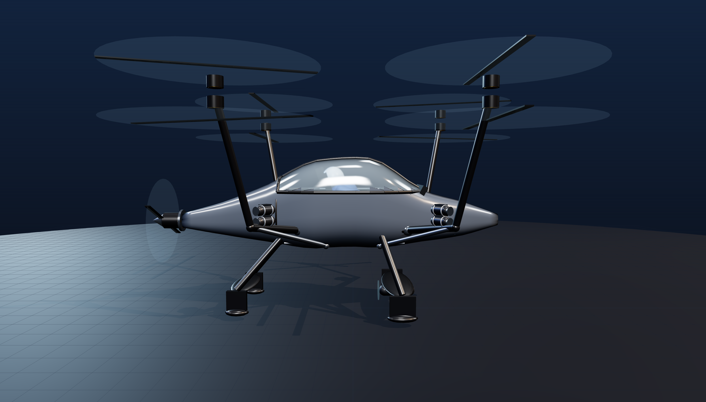
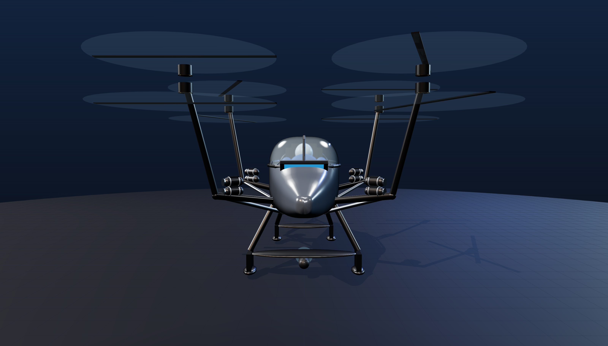
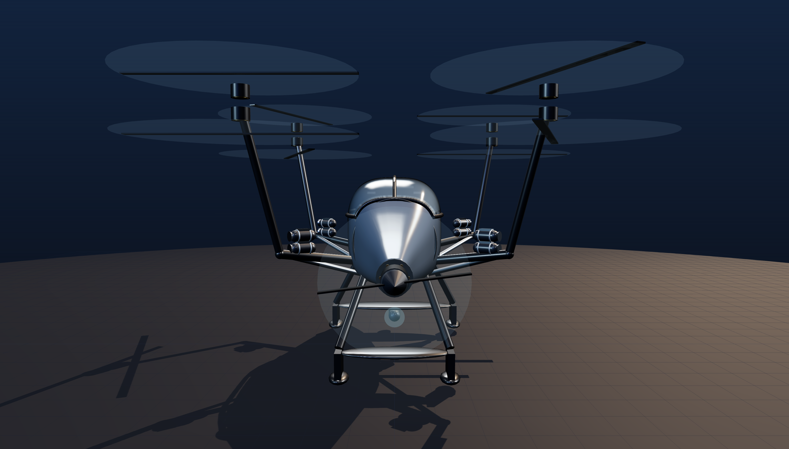

# Sky Tribe — Open Amphibious Personal eVTOL
*A single-seat electric flying machine that lands on water and takes off again. Designed and built in America, given away to everyone.*

**In one sentence:** Sky Tribe is an open-source design for a one-person electric VTOL aircraft that floats, with an interactive 3D CAD viewer and runnable Node scripts that check its geometry, performance and cost.

**Stage:** design and analysis. Nothing has been built or flown yet; the first hardware step (M1, one motor on a thrust stand) is still ahead.



> **Mission:** This project is about freedom of movement, not force. Quiet electric flight. Fewer barriers between people and places. A machine that treats the ocean as a friend — never a weapon. We build it to unite, to explore, and to give people more free will in how they move through the world.

| | |
|---|---|
|  |  |

**Proof you can run in a minute** (Node.js only, no npm install):
```bash
node geometry_audit.mjs     # 19 clearance checks, 0 FAIL, 0 WARN
node performance_model.mjs  # hover, endurance and range for P1 and P2
node project_cost.mjs       # parts, hidden costs, whole-program total
```
Then open `sky_tribe_viewer.html` in a browser to spin the CAD.

## What I built (Matt Macosko)
- **Interactive CAD viewer:** [`sky_tribe_viewer.html`](sky_tribe_viewer.html), with P1 / P2 / P3 configs, click-a-part price and spec cards, a narrated tour (`?present=1`) and PNG export (`?shot=1`). Shortcuts: [`sky_tribe_P1_heavy.html`](sky_tribe_P1_heavy.html), [`sky_tribe_P2_light.html`](sky_tribe_P2_light.html)
- **Geometry audits:** [`geometry_audit.mjs`](geometry_audit.mjs) (+ [`geometry_audit.html`](geometry_audit.html)), [`interior_audit.mjs`](interior_audit.mjs), [`hybrid_audit.mjs`](hybrid_audit.mjs)
- **Performance model:** [`performance_model.mjs`](performance_model.mjs) (hover power, max endurance, best-range speed)
- **Hybrid genset analysis:** [`hybrid_energy_model.mjs`](hybrid_energy_model.mjs), [`hybrid_bom.mjs`](hybrid_bom.mjs)
- **Cost and build order:** [`project_cost.mjs`](project_cost.mjs), [`build_order.mjs`](build_order.mjs), [`PARTS_LIST_BOM.md`](PARTS_LIST_BOM.md)
- **Research:** five rounds in [`RESEARCH_REPORT_*.md`](RESEARCH_REPORT_2026-07-13.md), plus [`WATER_STANCE.md`](WATER_STANCE.md)
- **Design history:** OpenSCAD models [`manned_quad_v2.scad`](manned_quad_v2.scad) through [`manned_quad_v7.scad`](manned_quad_v7.scad)

Upstream: 3D rendering uses [three.js](https://threejs.org/) (loaded from a CDN). The planned flight stack is upstream [ArduPilot](https://ardupilot.org/) / [PX4](https://px4.io/); see [`CREDITS.md`](CREDITS.md).

## What this is
A fully open-source design for a **single-seat coaxial-X8 electric VTOL** — eight motors on four arms — that is sealed and buoyant so it can **land on water and take off again**, like the waterproof RC drones, scaled up to carry one person.

Everything is open: the CAD, the parts list, the flight-control approach, and the research behind every decision. No proprietary black boxes. If someone already gave their work away (open-source flight software, published physics), we build on it and give ours away too.

**Every number below is one we can defend, including the ones that hurt.**

## Two aircraft, one airframe
The weight limit was blocking everything, so we stopped letting it. Same airframe, same X8, same quick-swap battery bay — two configurations in two different legal lanes.

| | **P1 — "the fat crazy one"** | **P2 — "the low-cost lightweight one"** |
|---|---|---|
| Empty | ~176 kg | ~124 kg |
| Battery | 13 kWh · 58 kg | 5 kWh · 20 kg |
| Endurance | **11.9 min hover · 15.1 min max** | **6.4 min hover · 7.9 min max** |
| Range | ~15 miles (at 73 mph) | ~6.6 miles (at 60 mph) |
| Speed | best-range 73 mph · level cruise (pusher) | best-range 60 mph · cruises 9–13° nose-down |
| Legal lane | Experimental amateur-built (N-number, licensed pilot) | **Part 103 ultralight** — no licence, no registration |
| Purpose | The learning machine. Flies first. Weight is not a constraint. | The production seed. Built with P1's lessons. |

P1 exists so the program isn't hostage to the 254 lb limit. P2 is the machine anyone can legally fly.

## Current design
- **Propulsion:** coaxial **X8** — 8 motors, 4 arms, 2× 62" counter-rotating props per arm, ~33 kg/m² disk loading
- **Why X8:** a flat quad has **no motor-out capability** — one dead motor or ESC and it is uncontrollable. The literature is blunt about it: a single-rotor failure on a manned quad is catastrophic, quads show the highest failure rate of the configurations studied, and **at least eight rotors** is what satisfies motor-out safety. A standard hexacopter is *not* fault-tolerant either — six rotors buys nothing.
- **Structure:** central carbon spar box carries all four arms, the seat and the gear. Booms **dog-leg outboard low, then climb** — nothing crosses the canopy. Each boom is braced from *below* by a keel strut, like a braced-wing aircraft's lift strut.
- **Flight control:** DIY triple-redundant, built on open-source **ArduPilot/PX4** across 3 voting boards — not an $18k proprietary box. This is the plan; the voting code is not in this repo yet.
- **Water:** sealed buoyant hull (**650 L against 261 L displaced — 2.5× reserve**), motors high, floats then flies. Never powers up through the surface.
- **Safety:** whole-aircraft ballistic parachute (Part 103 weight-exempt)

## Honest status — what does not close yet
- **Hover draws ~52 kW at P1's 261 kg all-up**, not the ~25 kW quoted early on. That figure was for a lighter quad, ignored the 9–15% coax penalty, and quoted shaft power rather than what the battery actually pays.
- **Endurance is the real problem, not speed.** P1 flies **15 minutes** and **15 miles**; P2 flies **8 minutes** and **6.6 miles**. These are hop-across-the-bay machines, not tourers.
- **Top speed is capped by the rotors, not power.** Past roughly **67 mph** (advance ratio 0.25) the advancing blade runs out of tip margin while the retreating blade loses grip. A pusher does *not* raise that ceiling — it buys a level cruise attitude and better efficiency, nothing more.
- **A genset roughly quadruples the endurance** — 5 gallons of petrol is 172 kWh thermal ≈ 43 kWh electrical, against 13 kWh in the battery, and under Part 103 *fuel is weight-exempt while batteries are not*. That is **49 minutes of hover against 12**. It costs **+$2,500 and +34 kg**: the full system is 92 kg (engine 42, generator 7, radiator 14, buffer 10, plus rectifier, mounts, exhaust and fuel system) versus 58 kg of battery. All-up rises to 309 kg, which needs **70 kg/motor** to fly — so the genset does not dodge M1, it leans on it harder. See `hybrid_bom.mjs`.
- **Thrust-to-weight is the live risk.** At 50 kg/motor P1 is only 1.35 — and 1.18 with a motor out. It needs **60–70 kg/motor**. **M1 (thrust-standing one motor) is the gate that decides whether P1 flies at all.**
- **P2 is ~9 kg over** the 115.2 kg Part 103 limit as drawn. The carbon layup has to close that gap.
- **Foiling doesn't close.** It floats and flies off water today — that part is sound. But the water pod is under-powered for the takeoff hump (~2.2 kW needed, ~2 kW modelled) and the foil is not yet a real cambered section. Foiling is Phase 2.
- **No flight-control code, test data or hardware exists yet.** Everything here is CAD, models and research.
- Jetson ONE proves 253 lb *is* achievable, so the P2 target is real.

## What it costs — honestly
The parts list is not the project. Both numbers matter, and they are far apart.

| | |
|---|---|
| **P1 — one aircraft, parts only** | **~$46,600** (up to ~$53,800 if the motors land at U15XXL-class) |
| P2 — lighter build, smaller pack, no pusher | ~$39,600 |
| P3 — same airframe, battery swapped for the genset | ~$49,100 |
| **P1 actually flying, all in** | **~$82,600** |
| Whole program (P1 + P2 + genset conversion) | ~$139,700 |

The gap between $46,600 and $82,600 is everything a parts list quietly omits: the
thrust stand, tether rig and ballast; carbon moulds, vacuum and consumables;
machining the spar box; wiring and HV safety gear; telemetry; spares; and an
**$8,000 crash allowance**, because M2 and M3 exist precisely to break things.
Labour is $0 — it assumes you build it yourself.

**The cheapest useful thing you can do is ~$5,300**: one motor, one prop, one ESC and
a thrust stand. That is M1, and it answers whether any of this flies before the big
money moves. Vendor numbers die on the stand. See `project_cost.mjs`.

### You do not build the cockpit first
The ladder already says M2 and M3 are unmanned and ballasted — so nothing that exists
for a *person* is needed to prove the machine hovers:

| | | |
|---|---|---|
| **Step 1 — M1** | one motor on a stand | **~$5,300** |
| **Step 2 — M2/M3** | a flying platform: spar box, arms, 8 motors, props, ESCs, battery, computers, plain test skids, tether | **~$33,300** |
| **Step 3 — M4/M5** | everything a human needs: tub, canopy, seat, panel, chute, foil gear, pusher | **~$18,100** |

The cockpit, the canopy, the parachute and the hydrofoil gear are **$18,100 you can
defer** until the aircraft has already hovered thousands of times. Build the platform.
Fly it empty. Add the human last — which is exactly what the safety ladder demanded
anyway. See `build_order.mjs`.

## Safety comes before any human ever flies it
**No person goes aboard until this is proven safe** — unmanned first, then ballasted, across many loads and conditions. The build order is non-negotiable:

1. **M0** — Close the weight budget on paper
2. **M1** — Thrust-stand ONE motor. **Vendor numbers die on the stand.**
3. **M2** — Full frame, tethered unmanned hover
4. **M3** — Ballasted tethered hover, thousands of cycles
5. **M4** — Manned, tethered, over water
6. **M5** — Free flight over water

## Geometry is audited, not eyeballed
`geometry_audit.mjs` checks the whole craft numerically — every boom and strut sampled along its length against the canopy, prop and rotor clearances, the coax spacing rule, gear-to-ground, pilot sightlines and headroom, battery fit at its **actual height**, and pusher clearances.

```bash
node geometry_audit.mjs     # 19 checks, 0 FAIL, 0 WARN
```

It exists because eyeballing kept missing real defects: arms passing through the canopy glass, a battery hanging out through the belly, the pilot's feet outside the fuselage, and a cockpit sill sitting *above* the pilot's eye line.

## Repository map
| File | What it is |
|------|-----------|
| `sky_tribe_viewer.html` | **The live CAD.** Interactive, photoreal, click any part for its price and spec |
| `sky_tribe_P1_heavy.html` / `sky_tribe_P2_light.html` | Open the CAD locked to either configuration |
| `geometry_audit.mjs` / `geometry_audit.html` | Automated clearance + interference audit |
| `interior_audit.mjs` / `hybrid_audit.mjs` | Cockpit parts and genset hardware fit inside the skin |
| `performance_model.mjs` / `hybrid_energy_model.mjs` | Hover, endurance, range; what fuel is worth |
| `project_cost.mjs` / `build_order.mjs` / `hybrid_bom.mjs` | Cost, staged spend, genset parts and mass |
| `PARTS_LIST_BOM.md` | Bill of materials (**being refreshed for the X8**) |
| `RESEARCH_REPORT_*.md` | Five rounds of fact-checked research, adversarially verified |
| `manned_quad_v2..v7.scad` | Design history (superseded by the viewer) |

**View the CAD:** open `sky_tribe_viewer.html` in any browser — no install, no account. It needs an internet connection, because three.js loads from unpkg.
`?cfg=p1|p2|p3` picks a configuration · `?present=1` runs a narrated tour · `?shot=1` renders a PNG

## How to contribute
Anyone may use, study, modify, and share this design. Improvements that keep it open are welcome — especially the weight budget, the redundant flight-control code, water sealing at scale, and the foil section. **Test data is as valuable as design changes.** No weapons work.

## License
Open hardware and open source, chosen so it can **never be locked up**:
- **Hardware / CAD:** [CERN-OHL-S-2.0](https://ohwr.org/cern_ohl_s_v2.txt) (strongly reciprocal — derivatives stay open)
- **Software:** [GPL-3.0](https://www.gnu.org/licenses/gpl-3.0.txt)
- **Documentation / research:** [CC-BY-SA-4.0](https://creativecommons.org/licenses/by-sa/4.0/)

You are free to build one. You are not free to take it private.
